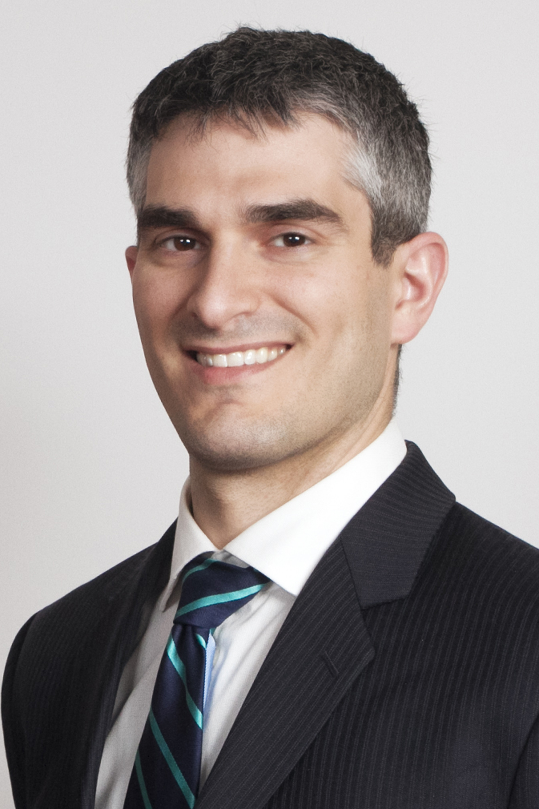

## About Dave

I live in the District of Columbia with my incredibly talented spouse and two young children.

For my day job, I am the General Counsel to the [Council of the District of Columbia](http://dccouncil.us). This website is not, however, an official site and nothing in the site should be construed as either (1) legal advice or solicitation, or (2) an endorsement by the Council of any of the views, data, or information shared on this site.

You can [read about some of the things I've been working on at the Council](http://www.govexec.com/state-local/2014/07/ultimate-open-government-unlocking-laws/87997/), but most of what I do is traditional legal work. I was honored this year to receive the D.C. Bar's [Exceptional Service Award](http://www.dcbar.org/about-the-bar/news/award-winners.cfm) for the establishment of the [Council's Pro Bono Program](http://dcclims1.dccouncil.us/images/00001/20130611180045.pdf). I am also active with the [D.C. Bar](http://dcbar.org) and with the [Uniform Law Commission](http://uniformlaws.org), and am a member of the [Washington Council of Lawyers](http://wclawyers.org).

On the side, I am an ["accomplished armchair coder"](http://www.washingtonpost.com/blogs/mike-debonis/wp/2014/03/19/dcdecoded-org-offers-better-public-access-to-d-c-laws/) and have written at least one ["clever piece of code."](http://gigaom.com/2014/06/12/clever-piece-of-code-exposes-hidden-changes-to-supreme-court-opinions/) For details about my projects, see my [Projects Page](projects.html). I recently was named a [FastCase 50 winner](http://www.fastcase.com/fastcase50-winners-2014/) for some of these projects.

## Contact
You can follow my public thoughts in 140 characters or fewer on [Twitter](https://twitter.com/vdavez) or track my coding on [GitHub](https://github.com/vzvenyach). Or you can email me at [dave@esq.io](mailto:dave@esq.io).
